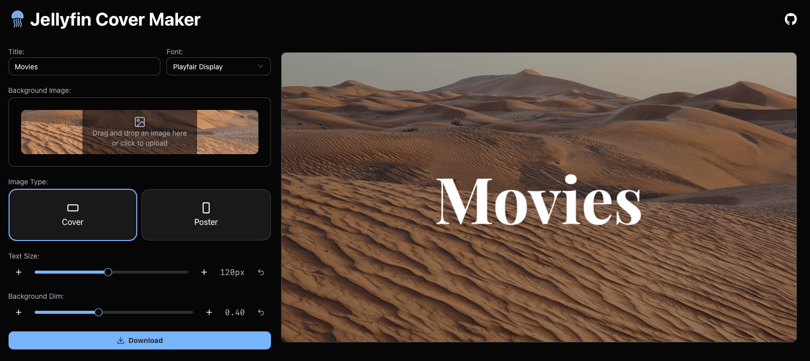

# Jellyfin Cover Maker

Easily create covers for your Jellyfin Libraries. This is a more easily usable alternative to [eebette's jellyfin tools](https://github.com/eebette/jellyfin-tools).

## How to use

1. Go to https://jfcovers.jan.run/
2. Enter a title
3. Upload an image
4. Download the cover

## Examples

<table>
  <tr>
    <td>
      
    </td>
    <td>
      
    </td>
  </tr>
  <tr>
    <td>
      
    </td>
    <td>
      
    </td>
  </tr>
</table>
